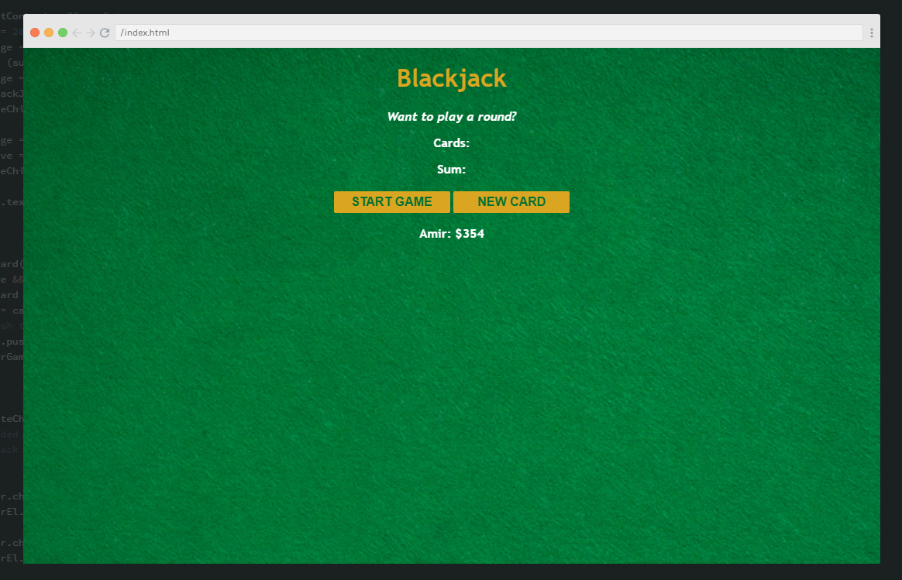

# Scrimba Project - Blackjack

This is an application created during the [Learn JavaScript for free](https://scrimba.com/learn/learnjavascript) course on Scrimba. 
Most of the application was taught how to code during the section, though I coded some extra features and added more spice to the Blackjack game app. 

## Table of contents

- [Overview](#overview)
  - [Links](#links)
  - [Demo](#demo)
  - [Screenshot](#screenshot)
- [My process](#my-process)
  - [Built with](#built-with)
  - [What I learned](#what-i-learned)
- [Author](#author)
- [Acknowledgments](#acknowledgments)

## Overview

### Links

- Solution URL: [Link](https://github.com/amir-the6th/Blackjack)
- Live Site URL: [Link](https://dazzling-hotteok-62e009.netlify.app/)

### Demo
(please wait for complete loading if not shown)

### Screenshot

#### Desktop

#### Mobile

## My process

### Built with

- HTML5
- CSS
- JavaScript

### What I learned

## Author

- Website - [Amir Sabagh](https://arsenicolos.com)
- GitHub - [@amir-the6th](https://github.com/amir-the6th)

## Acknowledgments
